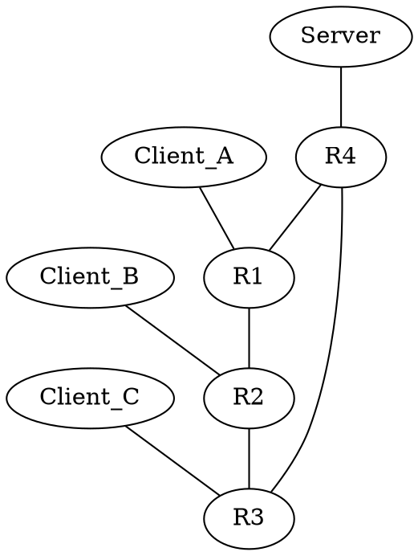

# Flow Analyzer

This app analyzes traffic flows in the network and displays the results in tabular and graphical format.

[](https://martimy-flow-analyzer-st-flow-0p35h8.streamlit.app/)

## Installation

Clone this repository to your local machine using this command:

```bash
$ git clone https://github.com/martimy/flow_analyzer
```

Once you have cloned the repository, navigate to the directory and install the necessary libraries with this command:

```bash
$ pip3 install -r requirements.txt
```

## Usage

To run the app, execute the following command in your terminal:

```bash
$ streamlit run st_flow.py
```

The app will open in your default web browser.


To analyze a network, you can upload a text file containing the network in DOT format. The app will parse the file, create a network graph, and display information about the edges and nodes in the network.

## How to Use

To use the Flow Analyzer app, follow these steps:

1. Run the app from the command line (Alternatively run it from streamlit). The app will open in your default web browser.

    ```bash
    $ streamlit run app.py
    ```

2. Upload the network topology in DOT format by clicking on the "Upload Network" button. If you don't have a network topology, you can use the example network included in the repository.

3. Upload the traffic flow information in CSV format by clicking on the "Upload Flow Information" button or edit the traffic flows using the editable dataframe.


## Input

The input to the Flow Analyzer app includes the following:

- Network topology: The network topology must be in DOT format. The app allows the user to upload a network topology in DOT format.

- Traffic flow information: The traffic flow information must be in CSV format. The app also allows the user to create or edit traffic flow information directly in the app.

- Spanning Tree: You can choose to apply Spanning Tree on the network by clicking on the checkbox "Apply Spanning Tree" in the sidebar. The pp will select the root node based on its name (default) or using the "ID" attribute. See below.

## Output

The output of the app includes the following:

### Link Traffic

The app displays information about the capacity and traffic flow on each link in the network in a table. The table includes the following columns:

- Source: The source node of the edge.
- Target: The destination node of the edge.
- FW: The amount of traffic originated from the source node.
- BK: The amount of traffic originated from the target node.

Only links with non-zero traffic are listed.

### Node Traffic

The app displays information about the traffic flow at each node in the network in a table. The table includes the following columns:

- Node: The name of the node.
- Outbound: The amount of traffic transmitted by the node.
- Inbound: The amount of traffic received by the node.

Only nodes with non-zero traffic are listed.

### Flow Visualization

The app also displays a visualization of the network topology. Traffic flows and selected routes in the network are displayed. You can also filter the flows by source or target from the sidebar. The filter affect both the flows and the routes these flows take over the network. Filtering does not affect the bandwidth values displayed on the network links.


## File Formats

Here is a description of the file formats needed by the app.

## DOT

A DOT file is a text file used to describe graphs. The graph in this file has nodes and edges connecting them, which can represent any relationship between them.

In the particular file below, there are eight nodes representing a network of one server, three clients and four routers. The '--' represents a bidirectional connection between nodes. For example, there is an edge connecting R1 and R2, which means that there is a connection between these two nodes.

Additional (optional) attributes may be needed for switched network to apply the Spanning Tree Protocol. Assigning an small "ID" attribute to a node ensures that it is selected as root of the tree. By default all links are assumed to be 100Mbps. Use the "speed" attribute to change the edge speed. Note that these attributes are case sensitive and they are only used to determine the spanning tree.  



For more information about the DOT language go [here](https://graphviz.org/doc/info/lang.html)


## CSV

A CSV (Comma-Separated Values) file is a plain text file format that is commonly used to store tabular data, such as spreadsheets or databases. In a CSV file, each line represents a row of data, and the values in each row are separated by commas.

A CSV file is used to upload traffic flow information between network node for traffic analysis. The example below shows the format needed for this app. The first line lists the columns' names (case sensitive). Each subsequent line represents the amount of traffic between the source and the destination of a data flow. The flows are directional, so traffic in the opposite direction must be specified separately.  

```csv
Source,Target,Flow
Server,Client_A,10
Server,Client_B,12
Server,Client_C,8
```

**Thank you for using the Flow Analyzer app!**
