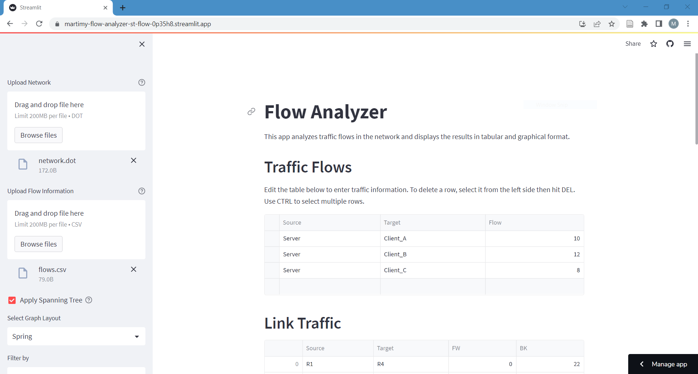
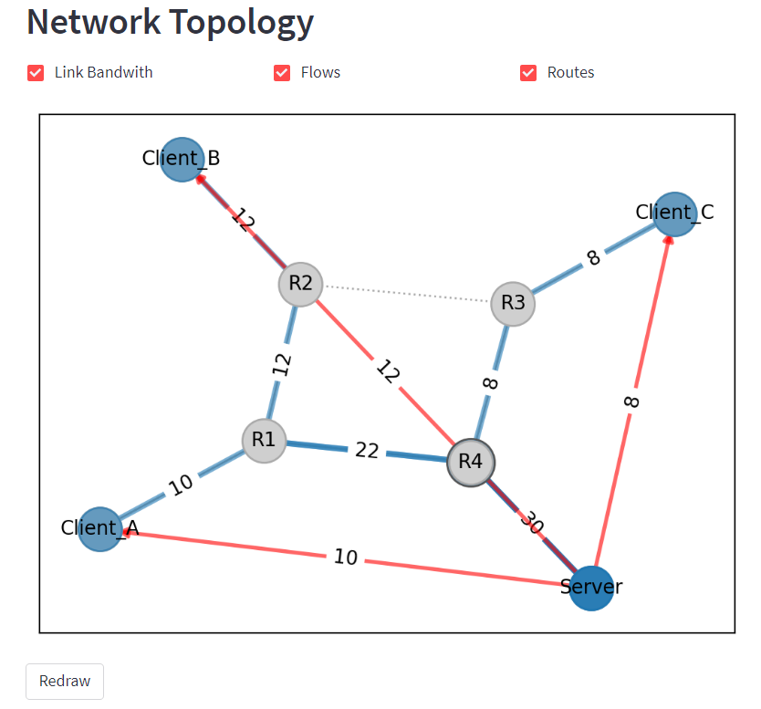

# Flow Analyzer

This app analyzes traffic flows in the network and displays the results in tabular and graphical format.

[](https://martimy-flow-analyzer-st-flow-0p35h8.streamlit.app/)

## Installation

Clone this repository to your local machine using this command:

```bash
$ git clone https://github.com/<USERNAME>/<REPOSITORY>.git
```

Once you have cloned the repository, navigate to the directory and install the necessary libraries with this command:

```bash
$ pip install -r requirements.txt
```

## Usage

To run the app, execute the following command in your terminal:

```bash
$ streamlit run app.py
```

The app will open in your default web browser.


To analyze a network, you can upload a text file containing the network in DOT format. The app will parse the file, create a network graph, and display information about the edges and nodes in the network.

Alternatively, you can use the built-in example network by checking the "Use example network" checkbox.


## How to Use

To use the Flow Analyzer app, follow these steps:

1. Run the app from the command line (Alternatively run it from streamlit). The app will open in your default web browser.

    ```bash
    $ streamlit run app.py
    ```

2. Upload the network topology in DOT format by clicking on the "Upload Network" button. If you don't have a network topology, you can use the demo network by clicking on the "Use demo network" checkbox.

3. Upload the traffic flow information in CSV format by clicking on the "Upload Flow Information" button or edit the traffic flows using the editable dataframe.




## Input

The input to the Flow Analyzer app includes the following:

- Network topology: The network topology must be in DOT format. The app allows the user to upload a network topology in DOT format or use the demo network.

- Traffic flow information: The traffic flow information must be in CSV format. The app also allows the user to create or edit traffic flow information.

- Spanning Tree: You can choose to apply Spanning Tree on the network by clicking on the checkbox "Apply Spanning Tree" in the sidebar.

## Output

The output of the app includes the following:

### Link Traffic

The app displays information about the capacity and traffic flow on each link in the network in a table. The table includes the following columns:

- Source: The source node of the edge.
- Target: The destination node of the edge.
- Tx: The amount of traffic originated from the source node.

Only links with non-zero traffic are listed.

### Node Traffic

The app displays information about the traffic flow at each node in the network in a table. The table includes the following columns:

- Node: The name of the node.
- Outbound: The amount of traffic transmitted by the node.
- Inbound: The amount of traffic received by the node.

Only nodes with non-zero traffic are listed.

### Flow Visualization

The app also displays a visualization of the network topology. Traffic flows and selected routes in the network are displayed. You can also filer the flows by source or target from the sidebar.



**Thank you for using the Flow Analyzer app!**
